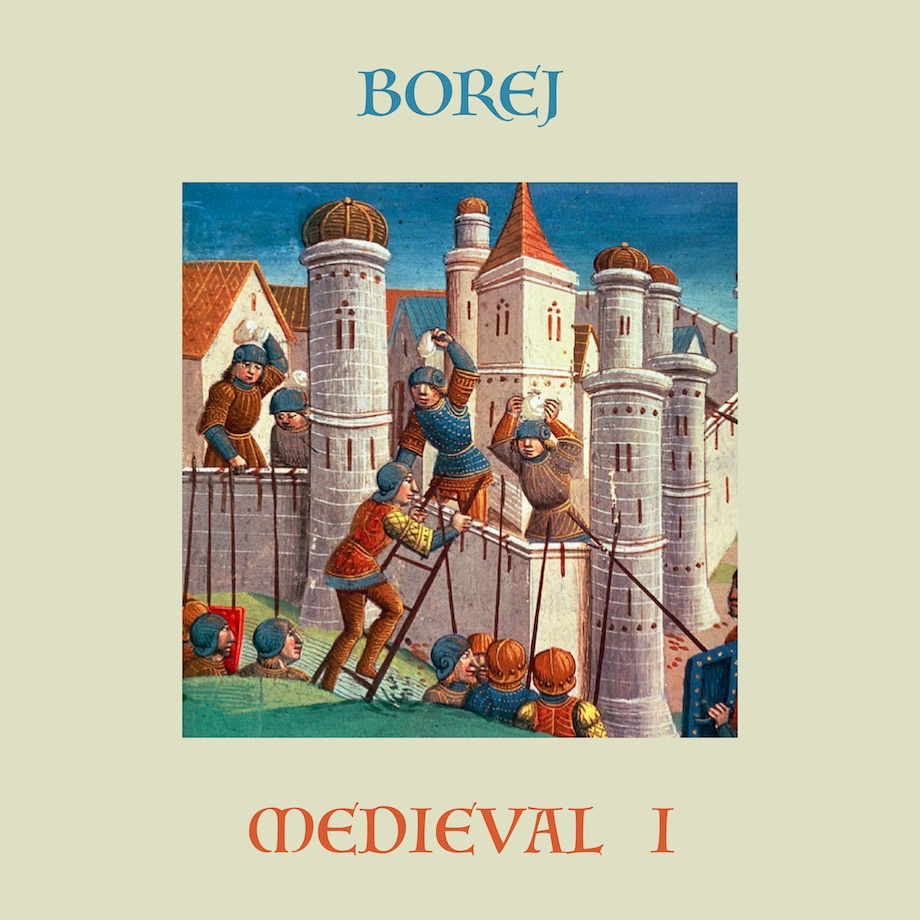

# Как я начал релизить второй альбом, и как мне помогли нейросети

Привет! Меня зовут Саша, я работю инженером компьютерного зрения, и в свободное время пишу музыку.

Я хочу, чтобы её услышало больше людей, но клянчить прослушивания и лайки, не давая ничего взамен, не хочу. Поэтому я поделюсь опытом. Вдруг кто-то тоже делает или хочет делать музло, но испытывает похожие переживания.

## Из-за чего весь сыр-бор?

Летом 2020го я бодро начал писать свой второй полноформатный альбом, но в итоге до сих пор его не закончил, и решил выпускать по частям. 25го февраля 2021го, вышла первая часть под названием Medieval I — сингл из двух треков.

Я расскажу

- как совмещаю основную работу с музыкой
- историю создания треков
- почему не дождался, пока закончу альбом целиком
- как делал графический арт для релиза

## 30 часов

Мой преподаватель Антон Маскелиаде говорит, что когда начинаешь делать трек, у тебя есть в среднем 30 часов, чтобы его закончить. По истечении этого времени композиция перестаёт драйвить и начинает бесить. Речь идёт о чистом времени, когда ты сидишь перед компом, записываешь партии, аранжируешь, сводишь. Если не успел, то дальше пропадает вдохновение и мотивация.

На своём опыте я наблюдал нечто похожее, но кажется, нашёл способ это время продлить. Нужно просто отложить трек и забыть на достаточно долгий период, а потом вернуться и попробовать закончить. Эдакое обнуление. В моём случае это заняло 4 года.

## Scream

В 2016 году, когда я только начинал писать электронную музыку, услышал трек Henry Saiz — Lucero del Alba.
<iframe width="560" height="315" src="https://www.youtube.com/embed/W7eTEcmsbfo?start=1089" frameborder="0" allow="accelerometer; autoplay; clipboard-write; encrypted-media; gyroscope; picture-in-picture" allowfullscreen></iframe>

Главная тема почему-то напоминала мне о старой советской поп-музыке. Что-то сентиментальное, похожее по настроению можно было услышать в прогнозе погоды. Хоть это и французская композиция, но прочно ассоциировалась с программой «Время».

<iframe width="560" height="315" src="https://www.youtube.com/embed/nv9_MqUL_cA" frameborder="0" allow="accelerometer; autoplay; clipboard-write; encrypted-media; gyroscope; picture-in-picture" allowfullscreen></iframe>

Я вдохновился, и захотел сделать что-то в том же духе. Простая романтичная мелодия и аккуратный танцевальный бит. Взял семпл кларнета, и начал импровизировать. Импровизация завела меня куда-то совсем далеко, где случайно я нашёл интересный приём: если играть ноту, и быстро нажимать на полоску изменения высоты звука на MIDI-контроллере, получается звук, который напоминает пронзительный крик.

Я сделал демку на 2 минуты и отнёс её на фидбэк сессию. Это такая тусовка, где музыканты слушают треки друг друга, отмечают положительные и отрицательные моменты. Там мне сказали, что идея офигенная, но истории и развития у трека нет. После первой части слушать скучно.

Примерно так звучала самая первая версия Scream. Тогда он ещё носил кодовое имя Soviet.
<iframe width="560" height="315" src="https://www.youtube.com/embed/6p11SduhPwQ" frameborder="0" allow="accelerometer; autoplay; clipboard-write; encrypted-media; gyroscope; picture-in-picture" allowfullscreen></iframe>

Я долго пытался придумать, как сделать трек интереснее, но эта простая главная тема казалась заунывной, и как будто мешала развитию. В итоге трек так и оставался недоделанным до карантина 2020 года.

Я выбросил всё, кроме приёма с полоской питч-шифтинга, сделал упор не на мелодию, а на гармонию, и в итоге остался доволен тем, что получилось.

## Castle

Вдохновение можно получать из разных мест. Кто-то гоняет в горы, кто-то смотрит кино или гуляет по спальному району на закате. Однажды я скачал семпл-пак с деревянными духовыми инструментами. Просто сидел, листал звуки, и когда наткнулся на кларнет, подумал, что клево им сыграть восходящие арпеджио. Так родилось вступление к треку Castle.

Через неделю в поезде Москва-Брянск накидал партию ударных. Случайно накинул эффект delay на дорожку с томами, и получился эффект каких-то ритуальных барабанов а-ля Woodkid - Iron. Там же в поезде практически закончил аранжировку. Вообще, когда появляются 4 свободных часа без интернета, можно совершать чудеса продуктивности.

В итоге получился вот такой трек:
<iframe width="100%" height="166" scrolling="no" frameborder="no" allow="autoplay" src="https://w.soundcloud.com/player/?url=https%3A//api.soundcloud.com/tracks/322241368&color=%23ff5500&auto_play=false&hide_related=false&show_comments=true&show_user=true&show_reposts=false&show_teaser=true"></iframe>
<a href="https://soundcloud.com/borejmusic" title="BOREJ" target="_blank" style="color: #cccccc; text-decoration: none;">BOREJ</a> · <a href="https://soundcloud.com/borejmusic/castle-version" title="Castle (version)" target="_blank" style="color: #cccccc; text-decoration: none;">Castle (version)</a>

Я снова отправил его на фидбэк-сессию, после которой знакомый музыкант Саша Сейнотов предложил сделать ремикс. У него вышло нечто более брутальное с тяжелым басом и элементами трэпа. Тем не менее композиционно мне понравилось сильнее, чем оригинал.

В итоге я сделал сашин ремикс мягче, добавил переходов и эффектов, и получилось то, что получилось.

Лайв-превью-анонс Castle.
<iframe width="560" height="315" src="https://www.youtube.com/embed/vTkkIiEVTFc" frameborder="0" allow="accelerometer; autoplay; clipboard-write; encrypted-media; gyroscope; picture-in-picture" allowfullscreen></iframe>

Кстати, если сравнить видосы Castle и Scream, можно заметить, как я потихоньку обустраивал музыкальный уголок.

## Выгорают не только программисты

Многие начинающие музыканты стремятся выпустить альбом. Крупное целостное произведение, которым они как бы сообщат миру: «я вообще-то тут не случайно, я вообще-то серьезный музыкант, я не просто балуюсь, вот выпустил альбом». Некоторые доказывают не кому-то, а сами себе.

Я тоже хотел и выпустил в 2019 году свой первый альбом [Aurora](https://songwhip.com/borej/aurora). В процессе я столкнулся с большим количеством приколов, о которых можно прочесть в другой [статье](https://dtf.ru/music/65745-kak-ya-vdohnovilsya-half-life-i-denom-simmonsom-i-zapisal-albom). После релиза я выдохнул, и понял, что не могу делать новую музыку.
Полгода я не садился за Аблетон, да и слушать чужое музло тоже не хотелось. Даже рутинную работу предпочитал делать в тишине. Слушал только разговорные подкасты и интервью.

Поначалу меня это беспокоило, но потом в общении с другими музыкантами я понял, что нужно просто подождать. Не заставлять себя, а кайфовать от других вещей, пока желание писать музыку не появится само собой.

Грянул весенний карантин 2020го года, количество вариантов досуга уменьшилось до предела, и я вернулся к музыке.

Вспомнил про два старых трека — Scream и Castle, которые давным-давно забросил, так и не доведя до официального релиза. Оба они имели некоторый воинственный средневековый характер, я решил доделать их и выпустить сингл на средневековую тематику. Но когда доделал, не смог остановиться, написал еще один и начал еще два трека с похожей атмосферой.

Тут я снова загорелся полноформатным альбомом. Казалось, что стоит еще чуть поднажать, и он будет завершен, ведь уже почти готовы 5 композиций. Но они не хотели дописываться быстро. Снова росла фрустрация от того, что часть музыки уже лежит готовая, а я все не могу ее никому показать. Еще свежа была память о выгорании от предыдущего альбома, и я решил придержать коней.

В итоге я сделал так, как и планировал изначально: выпустил сингл из двух треков. И сразу почувствовал себя лучше.

Из-за долгого отсутствия релизов и фидбэка я почти перестал ощущать себя музыкантом, и новый релиз вернул мне это ощущение.
Я понял, что если хочется что-то показать миру сейчас — показывай. Самое лучшее и актуальное время — прямо сейчас.

Не могу утверждать, что такой подход подойдет всем, но если вы чувствуете что-то похожее, то можете попробовать.

Более универсальная причина в том, что чем ближе результат работы, тем выше мотивация ее завершить. Написать и выложить один трек гораздо быстрее, чем целый альбом.

Ну и если быть уж совсем прагматиком, то выпуская свою музыку мелкими порциями, вы повышаете вероятность того, что ее услышат. Слушателю гораздо проще убедить себя послушать одну песню, чем получасовой альбом. А еще вы чаще сможете отправлять релизы в музыкальные паблики и плейлисты. Например, в Spotify есть [понятный механизм](https://artists.spotify.com/faq/promotion#pitching-music-to-playlist-editors=) попадания в редакторские подборки. Просто заполняешь анкету и пишешь 500 знаков текста. Главное ограничение — можно послать лишь один трек из релиза.

## Хобби vs профессия

Я обучаю нейросети и строю из них инструменты для других людей, но не особо горю этим. Да, мне нравится разнообразие задач, и результаты моей работы. Но в ней довольно много рутины и неудачных экспериментов, которые не очень-то радуют.

На этом фоне, когда появляются малейшие признаки успеха в музыке, появляется искушение бросить всё и построить карьеру с нуля. Получить миллион прослушиваний в месяц на Spotify и жить на пассивный доход.
В эти моменты я себя отрезвляю тем, что музыкальный бизнес — это гораздо больше, чем просто писать треки. Реклама, маркетинг и пиар — во всё это не особо хочется погружаться глубоко. Одно дело – закинуть 1000 рублей на рекламу в инстаграме, а другое дело – построить контент-план, написать во все музыкальные паблики, подать заявки на все фестивали и судорожно пытаться познакомиться с людьми, которые напишут о тебе в Афише или Медузе.

И тут я прихожу к тому, что врядли музыка в ближайшее время будет приносить столько денег, сколько приносит программирование. Но рутины в карьере профессионального музыканта если не больше, то уж точно не меньше, чем в жизни программиста.

С другой же стороны, вся прелесть хобби в том, что никто не ждёт результатов и не ставит дедлайнов, кроме тебя самого. Наверно, можно это сравнить с бизнесом, но отличие в том, что от успешности бизнеса всё-таки зависит, поешь ты завтра или нет.

Как итог, я не парюсь и просто делаю музыку так, как мне кайфово, и с такой периодичностью, с которой мне кайфово.

## Как нейросети помогли создать анимированную обложку

Современные технологии не всегда делают творчество бездушным и механическим. Часто они могут добавить что-то новое или помочь найти короткий путь, тем самым сохранить мотивацию и вдохновение.

Средневековую иллюстрацию с осадой замка я нашёл давно.

Она нравилась мне сочетанием цветов, композицией и, казалось, идеально передает атмосферу трека Castle.
Я долго сомневался, легально ли использовать ее в качестве обложки, но в итоге наткнулся на [страницу в википедии](https://commons.wikimedia.org/wiki/File:Siege_of_a_city,_medieval_miniature.jpg), которая гласит, что поскольку оригинальному произведению исполнилось более 100 лет, изображение находится в открытом доступе для любого использования.

Затем сделал несколько вариантов квадратной обложки, отправил моему другу дизайнеру [Антону Бадашову](http://badashov.com/) на ревью, и остановился на той, которую вы могли увидеть в начале статьи.

Потом стал думать, что же можно ещё сделать интересного, чтобы было красиво и привлекало внимание. В голове крутилась идея создания анимационного клипа, в котором бы исходная иллюстрация оживала, между персонажами появлись взаимоотношения и какой-то сюжет. Но это было за гранью моих навыков, поэтому я решил сделать что-то проще.

Пока грезил анимацией, вспомнил, что летом 2020 я наткнулся на твит с симпатичными параллакс-гифками.

К твиту была прикреплена ссылка на [репозиторий на Гитхабе](https://github.com/vt-vl-lab/3d-photo-inpainting)

Эти гифки были сгенерированы с помощью нейронной сети, которая строит карту глубины по статичной картинке, тем самым позволяет отделить передний фон от заднего и двигать их независимо.

Я [допилил напильником](https://github.com/sashulyak/3d-photo-inpainting) код по ссылке выше, так чтобы он не даунскейлил исходную картинку, и видео получалось более качественное. А потом написал [скрипт](https://github.com/sashulyak/loop_animator), который изменяет скорость гифки, зацикливает её назад-вперёд и фиксит количество FPS. Получилось вот так:

Оставалось придумать, куда такую анимацию воткнуть. На полноценный клип для Youtube это не тянет.
Первое применение — использовать гифку для привлечения внимания к постам в соцсетях.
Второе — [Spotify Canvas](https://canvas.spotify.com/en-us). Не так давно Spotify разрешил исполнителям добавлять анимированные фоны для своих треков, которые воспроизводятся в мобильном приложении, пока играет музыка.

В итоге, я сделал вертикальные кропы исходной картинки, подходящие под требования Spotify, анимировал их и вот что вышло:

К сожалению, Canvas пока не работает в Росии, и я могу их видеть только как превьюшки. Если кто-то из Европы сделает скрин, и покажет как это выглядит в жизни, будет очень круто =)

Что я выненс из этой истории? Когда есть возможность состыковать свою профессиональную деятельность с хобби — это очень круто. Сразу получаешь больше удовольствия и от работы и от хобби. Повышается самооценка и уверенность в себе.
