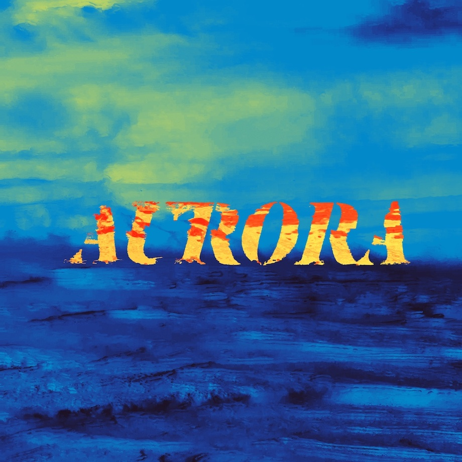

# Музыканты тоже выгорают

Привет! Меня зовут Саша, я работю инженером компьютерного зрения, и в свободное время пишу музыку.

Летом 2020го я бодро начал писать свой второй полноформатный альбом, но в итоге до сих пор не закончил, и решил выпускать по частям. 25го февраля 2021го, вышла первая часть под названием [Medieval I](https://songwhip.com/borej/medieval-i/) — сингл из двух треков.

Я расскажу:

- почему не дождался, пока закончу альбом целиком
- историю создания треков
- как совмещаю основную работу с музыкой
- как делал графический арт для релиза

## Священный грааль полноформатного альбома

Начинающие музыканты стремятся выпустить альбом. Крупное целостное произведение, которым они докажут миру и самим себе: «я вообще-то тут не случайно, я не просто балуюсь, вот выпустил альбом».

Я тоже хотел, и в 2019 году выпустил свой первый альбом [Aurora](https://songwhip.com/borej/aurora). В процессе столкнулся с большим количеством приколов, о которых можно прочесть в другой [статье](https://dtf.ru/music/65745-kak-ya-vdohnovilsya-half-life-i-denom-simmonsom-i-zapisal-albom). После релиза я выдохнул, и понял, что не могу делать новую музыку.

Полгода я не садился за Ableton, да и слушать чужое музло тоже не хотелось. Даже рутинную работу предпочитал делать в тишине. Только разговорные подкасты и интервью во время прогулок и за едой.

Помогло общение с другими музыкантами. Я начинал учиться музыкальному продакшну на [курсах Антона Маскелиаде](https://maskeliade.school/), и там же познакомился с классными ребятами. Кто бы мог подумать, что я не первый человек, который выгорел от тяжёлого длительного проекта.

Должен ли художник страдать — вечная тема для дискуссий. Но если не брать статистические выбросы в виде отдельных гениев, то музыканты испытывают такие же потребности и чувства, как и все остальные. Самое распространённое топливо для творчества — это отдых, вкусная еда и новые впечатления.

Поэтому, я решил не заставлять себя, а кайфовать от других вещей, пока желание писать треки не появится само собой. А потом грянул весенний карантин 2020го года, количество вариантов досуга уменьшилось до предела, и я вернулся к музыке.

## Охлади трахание

Scream и Castle — это два старых трека, которые я давным-давно забросил, так и не доведя до официального релиза. Оба они имели воинственный средневековый характер. Я решил доделать их и выпустить сингл на средневековую тематику. Но когда закончил, не смог остановиться, написал еще один трек, и начал еще два с похожей атмосферой.

Тут я снова загорелся полноформатным альбомом. Казалось, что стоит еще чуть поднажать, и он будет завершен, ведь уже почти готовы 5 композиций. Но они не хотели дописываться быстро. Снова росло беспокойство от того, что часть музыки уже лежит готовая, а я все не могу ее никому показать.

Я только что оправился от выгорания, поэтому решил придержать коней. Выпустил сингл из двух треков, и сразу почувствовал себя лучше.

Новый релиз помог мне снова почувствовать себя музыкантом и поверить в себя. Я понял, что если хочется что-то показать миру — показывай. Самое лучшее и актуальное время — прямо сейчас.

Кроме того, чем ближе результат работы, тем выше мотивация ее завершить. Написать и выложить один трек гораздо быстрее, чем целый альбом.

Ну и если быть уж совсем прагматиком, то выпуская свою музыку мелкими порциями, вы повышаете вероятность того, что ее услышат. Слушателю гораздо проще убедить себя послушать одну песню, чем получасовой альбом. А еще вы чаще сможете отправлять релизы в музыкальные паблики и плейлисты. Например, в Spotify есть [понятный механизм](https://artists.spotify.com/faq/promotion#pitching-music-to-playlist-editors=) попадания в редакторские подборки. Просто заполняешь анкету и пишешь 500 знаков текста. Главное ограничение — можно послать лишь один трек из релиза.

## 30 часов

Мой преподаватель Антон Маскелиаде говорит, что когда начинаешь делать трек, у тебя есть в среднем 30 часов, чтобы его закончить. По истечении этого времени композиция перестаёт драйвить и начинает бесить. Речь идёт о чистом времени, когда ты сидишь перед компом, записываешь партии, аранжируешь, сводишь. Если не успел, то дальше пропадает вдохновение и мотивация.

Но есть способ это время продлить: можно надолго отложить, а потом вернуться и закончить. Я взял треки, которые начал 4 года назад, и у меня получилось.

## Scream

В 2016 году, когда я только начинал писать электронную музыку, услышал трек Henry Saiz — Lucero del Alba.

https://www.youtube.com/watch?v=W7eTEcmsbfo?start=1089

Главная тема напоминала о старой советской эстраде. Сентиментальная, похожая по настроению на музыку из прогноза погоды.

https://www.youtube.com/watch?v=nv9_MqUL_cA

Я вдохновился, и захотел сделать что-то в том же духе. Простая романтичная мелодия и аккуратный танцевальный бит. Взял семпл кларнета, и начал импровизировать.

Импровизация завела меня куда-то совсем далеко. Случайно я нашёл интересный приём: если играть ноту, и быстро нажимать на полоску изменения высоты звука на MIDI-контроллере, получается звук, который напоминает пронзительный крик.

Я сделал демку на 2 минуты и отнёс её на фидбэк сессию. Это такая тусовка, где музыканты слушают треки друг друга, отмечают положительные и отрицательные моменты. Там мне сказали, что идея офигенная, но истории и развития у трека нет. После первой части слушать скучно.

Примерно так звучала самая первая версия Scream. Тогда он ещё носил кодовое имя Soviet.

https://www.youtube.com/watch?v=6p11SduhPwQ

Я долго пытался придумать, как сделать трек интереснее, но эта простая главная тема казалась унылой, и как будто мешала развитию. В итоге трек так и оставался недоделанным до карантина 2020 года.

Я выбросил всё, кроме приёма с полоской питч-шифтинга, сделал упор не на мелодию, а на гармонию, и в итоге остался доволен тем, что получилось.

https://www.youtube.com/watch?v=2QjoQWzJs4I

## Castle

Вдохновение получают из разных источнников. Кто-то гоняет в горы, кто-то смотрит кино или гуляет по спальному району на закате. Однажды я скачал семпл-пак с деревянными духовыми инструментами. Сидел, листал звуки, и когда наткнулся на кларнет, подумал, что клево им сыграть восходящие арпеджио. Так родилось вступление к треку Castle.

Через неделю в поезде Москва-Брянск накидал партию ударных. Случайно накинул эффект delay на дорожку с томами, и получились какие-то ритуальные барабаны а-ля [Woodkid – Iron](https://www.youtube.com/watch?v=vSkb0kDacjs). Там же в поезде практически закончил аранжировку. Когда появляются 4 свободных часа без интернета, свершаются чудеса продуктивности.

В итоге получился вот такой [трек](https://soundcloud.com/borejmusic/castle-version). Вот небольшой лайв-превью-анонс первой версии:

https://www.youtube.com/watch?v=vTkkIiEVTFc

Я снова отправил его на фидбэк-сессию, после которой знакомый музыкант Саша Сейнотов предложил сделать ремикс. У него вышло нечто более брутальное с тяжелым басом и элементами трэпа. Композиционно мне понравилось сильнее, чем оригинал, но звучание слишком сильно изменилось.

Ремикс и оригинал пролежали в моём Яндекс Диске 4 года, в обоих мне чего-то не хватало. Летом 2020го я собрал из них нечто среднее, и остался доволен.

https://www.youtube.com/watch?v=T4ePxJW6tlg

## Хобби vs профессия

Я обучаю нейросети, но не особо горю этим. Да, мне нравится разнообразие задач и результаты работы. Но в ней много рутины и неудачных экспериментов.

При малейших успехах в музыке появляется мысль бросить всё и построить карьеру с нуля. Получить миллион прослушиваний на Spotify и жить на пассивный доход.

Я себя отрезвляю тем, что музыкальный бизнес — это гораздо больше, чем просто писать треки. Реклама, маркетинг и пиар — во всё это не особо хочется погружаться. Одно дело — закинуть 1000 рублей на рекламу в инстаграме, а другое дело — построить контент-план, написать во все музыкальные паблики, подать заявки на все фестивали и судорожно пытаться познакомиться с людьми, которые напишут о тебе в Афише или Медузе.

От лейблов тоже не стоит ждать манны небесной. Никому не нужен несамостоятельный, пусть и талантливый, артист. Зачем тратить силы на раскрутку ноунейма, когда есть куча трудолюбивых ребят со своей небольшой аудиторией? Всё как со стартапами и инвестициями, чистый бизнес.

Кроме того, в ближайшее время музыка не будет приносить мне столько денег, сколько приносит программирование. Но рутины в карьере профессионального музыканта если не больше, то уж точно не меньше, чем в жизни программиста.

Вся прелесть хобби в том, что никто не ждёт результатов и не ставит дедлайнов, кроме тебя самого. «Просто делай музыку так, как тебе кайфово, и с такой периодичностью, с которой тебе кайфово, Саня».

Я перестал париться, и вместо мук выбора придумал, как профессия может помочь хобби.

## Как нейросети помогли создать анимированную обложку

Современные технологии не всегда делают творчество бездушным и механическим. Часто они добавляют что-то новое или помогают найти короткий путь, тем самым сохранить мотивацию и вдохновение.

Средневековую иллюстрацию с осадой замка я нашёл давно.

Она понравилась сочетанием цветов, композицией и, казалось, идеально передает атмосферу трека Castle.
Я долго сомневался, легально ли использовать ее в качестве обложки, но потом нашёл [страницу в википедии](https://commons.wikimedia.org/wiki/File:Siege_of_a_city,_medieval_miniature.jpg), которая гласит, что поскольку оригинальному произведению исполнилось более 100 лет, изображение находится в открытом доступе для любого использования.

Затем сделал 8 вариантов квадратной обложки и отправил на ревью моему другу дизайнеру [Антону Бадашову](http://badashov.com/). Остановился на той, которую вы могли увидеть в начале статьи.

Потом стал думать, что же можно ещё сделать интересного, чтобы было красиво и привлекало внимание. В голове крутилась идея создания анимационного клипа, в котором бы исходная иллюстрация оживала, между персонажами появлись взаимоотношения и сюжет. Но это было за гранью моих навыков, поэтому я решил сделать что-то проще.

Пока грезил анимацией, вспомнил, что летом 2020 я наткнулся на твит с симпатичными параллакс-гифками. В твите была ссылка на [репозиторий на Гитхабе](https://github.com/vt-vl-lab/3d-photo-inpainting)

Эти гифки сгенерированы с помощью нейронной сети, которая строит карту глубины по статичной картинке, тем самым позволяет отделить передний фон от заднего и двигать их независимо.

Я [допилил напильником](https://github.com/sashulyak/3d-photo-inpainting) код по ссылке выше, так чтобы он не даунскейлил исходную картинку, и видео получалось более качественное. А потом написал [скрипт](https://github.com/sashulyak/loop_animator), который изменяет скорость гифки, зацикливает её назад-вперёд и фиксит количество FPS. Получилось вот так:

Оставалось придумать, куда такую анимацию воткнуть. На полноценный клип для Youtube это не тянет.
Первое применение — использовать гифку для привлечения внимания к постам в соцсетях.
Второе — [Spotify Canvas](https://canvas.spotify.com/en-us).

Недавно Spotify разрешил исполнителям добавлять анимированные фоны для своих треков, которые воспроизводятся в мобильном приложении, пока играет музыка.
Я сделал вертикальные кропы исходной картинки, подходящие под требования Spotify, анимировал их и вот что вышло:

К сожалению, Canvas пока не работает в России, и я могу их видеть только как превьюшки. Если кто-то из Европы сделает скрин, и покажет как это выглядит в жизни, буду благодарен =)

Когда можешь состыковать свою профессию с хобби — это очень круто. Сразу получаешь больше удовольствия и от работы, и от хобби. Я вот анимашки нагенерил. А вы можете промо-страницу запилить, сшить костюм для выступлений или наснимать красивых фоточек в тему.

## Выводы?

Не претендую на откровения и новизну. Про выгорание написано миллион текстов и рассказаны тысячи лекций. Что работает в IT, работает и в других сферах. Отдых, новые впечатления, смена деятельности.

Резкая смена курса и карьеры — не всегда лучший выход. Иногда можно совместить старое и новое, любимое и нелюбимое. По крайней мере на время, пока не почувствуешь, что готов.

Ну и ещё одна не новая мысль: полезно общаться с другими людьми. Многие ваши проблемы уже у кого-то возникали. Ещё круче найти комьюнити единомышеленников, чтобы всегда иметь рядом людей с релевантным опытом.

Будьте здоровы, и спасибо, что дочитали. Вы – клёвые!
